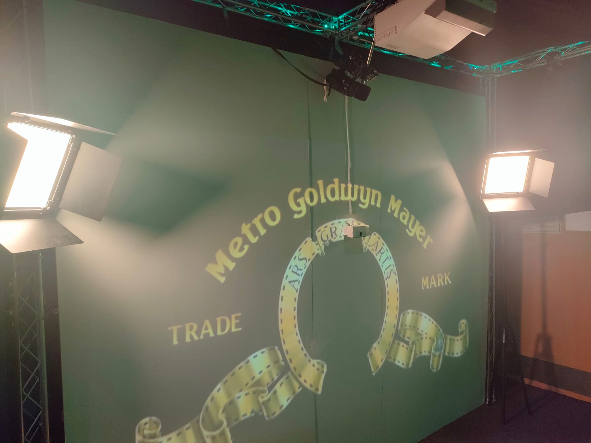

# EGL314 TEAM D (PHOTO BOOTH)


# Introduction of our project
Since it is our last semester and we are about to head off for our internship, we decided to commemorate our memories for this school semester and installed cameras for previewing and taking the photos. This is our project, photobooth.

# Storyboard
(UPDATE!!!)

# System Diagrams
## Control Diagram


## Video Diagram


## Lighting Diagram


## Audio Diagram


# Floor Plan and Layout
.jpg>)

# Equipment List
.jpg)

# Server Rack Setup


# Projector Setup


# Video Setup

Sequence setup inside pandora box.

Tcp connection setup in the widget designer for the raspberry pi to communicate with the pandora box.

# Gui Setup


# Audio Setup


This the type of cable used

I place all my audio in this software called Reaper.

# Lighting Setup


This is the dmx driver that we connect to the artnet-dmx node.

# Cameras Setup

Two Cameras-> Video Cam and Webcam

# Final Setup


# Socket Configuration
```
TCP_IP = '192.168.1.50'
TCP_PORT = 5020
BUFFER_SIZE = 1024

s = socket.socket(socket.AF_INET, socket.SOCK_STREAM)
s.connect((TCP_IP, TCP_PORT))
```
This section configures the socket connection's TCP/IP address, port number, and buffer size. It generates a socket object, 's', with the supplied IP address and port number, and connects to the specified server.

# Video Capture Initialization
```
cap = cv2.VideoCapture(0)
```
The code creates a 'cap' video capture object to collect frames from the default camera (index 0). This object will be used later to get video frames.

# GUI Button Programming
```
SeqSetState(1,"Play")
```
This is for the play button to play the music.
```
SeqSetState(1,"Pause")
```
This is for pausing the music.
```
CurrentcueNum = 1
SeqGotoCue(1,CurrentcueNum)
SeqSetState(1,"Play")
```
This is to reset the music.
```
DeviceSetParam(2,2,"Opacity",255)
DeviceSetParam(2,3,"Opacity",255)
DeviceSetParam(2,4,"Opacity",255)
WDWait(5)
DeviceSetParam(2,2,"Opacity",0)
DeviceSetParam(2,3,"Opacity",0)
DeviceSetParam(2,4,"Opacity",0)
```
This code is for showing the fun poses that the user can do, when pressed it will appear for 5 seconds afterwards it will be gone.
```
PlaySound("C:\321Effect\Sound effect.wav")
```
This code is for playing the countdown sound when the picture taking button is pressed.


# Taking Picture Programming

### Importing Modules:
```
import os
import cv2
```
This code snippet imports two important libraries: `os` (for working with the operating system) and `cv2`(OpenCV, a library for computer vision tasks, including working with images and videos).

### read_last_image_number Function:
```
def read_last_image_number(file_path):
    if not os.path.exists(file_path):
        return 1
    with open(file_path, 'r') as file:
        try:
            return int(file.read())
        except ValueError:
            return 1

```
This function reads the last image number from a given file path. If the file doesn't exist, it assumes no images have been captured yet and returns 1. If the file exists, it reads its content, which should contain the last image number, and converts it to an integer. If there's an issue converting the content to a number (e.g., if it's not a valid number), the function defaults to returning 1.

### read_last_image_number Function:
```
def write_last_image_number(file_path, image_number):
    with open(file_path, 'w') as file:
        file.write(str(image_number))
```
This function writes the current image number to a specified file. It opens the file at the given path in write mode and writes the image number as a string to the file.

### capture_image Function:
```
def capture_image(save_folder, number_file_path):
    camera = cv2.VideoCapture(0)
    
    if not camera.isOpened():
        print("Error: Unable to access the camera.")
        return
    

```
This is the main function responsible for capturing images using the computer's camera. It takes two arguments: save_folder (the folder where the captured images will be saved) and number_file_path (the path to the file containing the last image number).

The function starts by attempting to open the default camera (camera index 0) using cv2.VideoCapture(0). If the camera cannot be opened, it prints an error message and


### Image Capture Loop:
```
image_number = read_last_image_number(number_file_path)
while True:
    ret, frame = camera.read()
    if not ret:
        print("Error: Unable to capture frame.")
        break
    cv2.imshow("Press Enter to Capture", frame)
    if cv2.waitKey(1) == 13:
        
```
Inside the loop, the function reads the last image number using the read_last_image_number function. Then, it enters a loop where it captures frames from the camera using camera.read(). Each captured frame is stored in the frame variable. If there's an issue capturing a frame, an error message is printed, and the loop is broken.

The captured frame is displayed in a window named "Press Enter to Capture" using cv2.imshow.

The loop waits for the Enter key to be pressed (cv2.waitKey(1) == 13). When Enter is pressed, the code inside the if block is executed.

### Saving the Captured Image:
```
image_filename = f"captured_image_{image_number:03d}.jpg"
image_path = os.path.join(save_folder, image_filename)
cv2.imwrite(image_path, frame)
print(f"Image captured successfully and saved as '{image_path}'")
image_number += 1
write_last_image_number(number_file_path, image_number)
break

        
```
This part generates a filename for the captured image based on the current image number. It uses zero-padding to ensure the filenames are consistent (e.g., "captured_image_001.jpg", "captured_image_002.jpg", etc.). The image is saved in the specified save_folder using cv2.imwrite.

The image number is then incremented, and the write_last_image_number function is called to update the image number in the file. Finally, the loop is broken to stop capturing images.

### Releasing Resources:
```
camera.release()
cv2.destroyAllWindows()
      
```
After the loop, the camera resources are released using camera.release(). Additionally, any open windows created by cv2.imshow are closed using cv2.destroyAllWindows().

### Main Execution:
```
if __name__ == "__main__":
    folder_path = "c:/Users/XXXX/Desktop/315/315 4-8/Image PhotoBooth"
    number_file_path = "image_number.txt"
    capture_image(folder_path, number_file_path)  
```
This part of the code checks if the script is being run as the main program. If it is, it specifies the folder where the captured images should be saved (folder_path) and the path to the file containing the image number (number_file_path). Then, it calls the capture_image function to start capturing images.