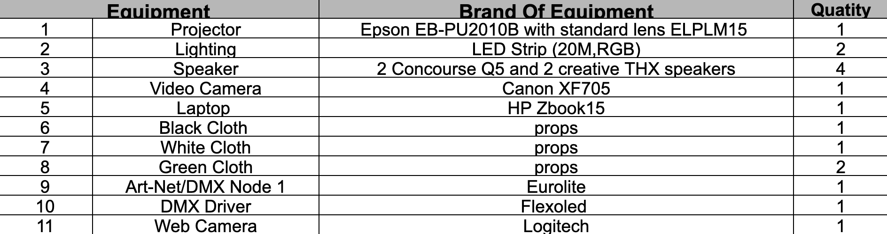

# EGL314 TEAM D (PHOTO BOOTH)


# Introduction of our project
(UPDATE!!!)

# Storyboard


# System Diagrams
## Control Diagram


## Video Diagram


## Lighting Diagram


## Audio Diagram


# Floor Plan and Layout
(UPDATE!!!)

# Equipment List


# Server Rack Setup


# Projector Setup


# Video Setup

Sequence setup inside pandora box.

Tcp connection setup in the widget designer for the raspberry pi to communicate with the pandora box.

# Gui Setup


# Audio Setup


This the type of cable used

# Lighting Setup


This is the dmx driver that we connect to the artnet-dmx node.

# Cameras Setup

Two Cameras-> Video Cam and Webcam

# Final Setup


# Socket Configuration
```
TCP_IP = '192.168.1.50'
TCP_PORT = 5020
BUFFER_SIZE = 1024

s = socket.socket(socket.AF_INET, socket.SOCK_STREAM)
s.connect((TCP_IP, TCP_PORT))
```
This section configures the socket connection's TCP/IP address, port number, and buffer size. It generates a socket object, 's', with the supplied IP address and port number, and connects to the specified server.

# Video Capture Initialization
```
cap = cv2.VideoCapture(0)
```
The code creates a 'cap' video capture object to collect frames from the default camera (index 0). This object will be used later to get video frames.

# GUI Button Programming
```
SeqSetState(1,"Play")
```
This is for the play button to play the music.
```
SeqSetState(1,"Pause")
```
This is for pausing the music.
```
CurrentcueNum = 1
SeqGotoCue(1,CurrentcueNum)
SeqSetState(1,"Play")
```
This is to reset the music.
```
DeviceSetParam(2,2,"Opacity",255)
DeviceSetParam(2,3,"Opacity",255)
DeviceSetParam(2,4,"Opacity",255)
WDWait(5)
DeviceSetParam(2,2,"Opacity",0)
DeviceSetParam(2,3,"Opacity",0)
DeviceSetParam(2,4,"Opacity",0)
```
This code is for showing the fun poses that the user can do, when pressed it will appear for 5 seconds afterwards it will be gone.
```
PlaySound("C:\321Effect\Sound effect.wav")
```
This code is for playing the countdown sound when the picture taking button is pressed.